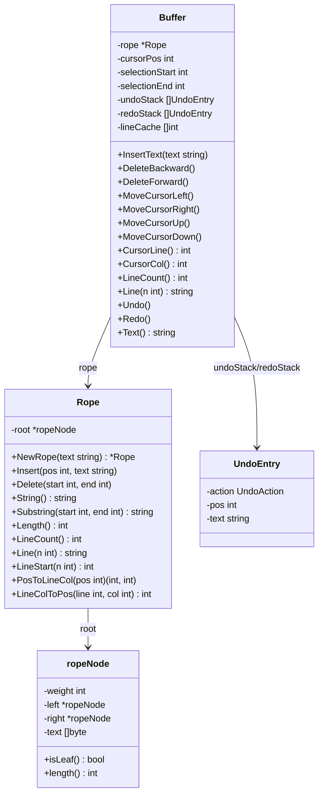
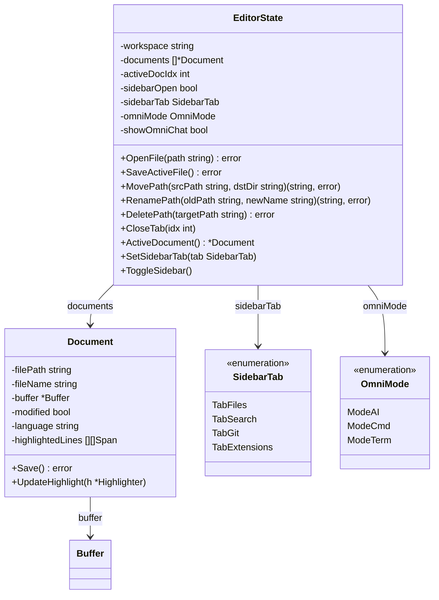
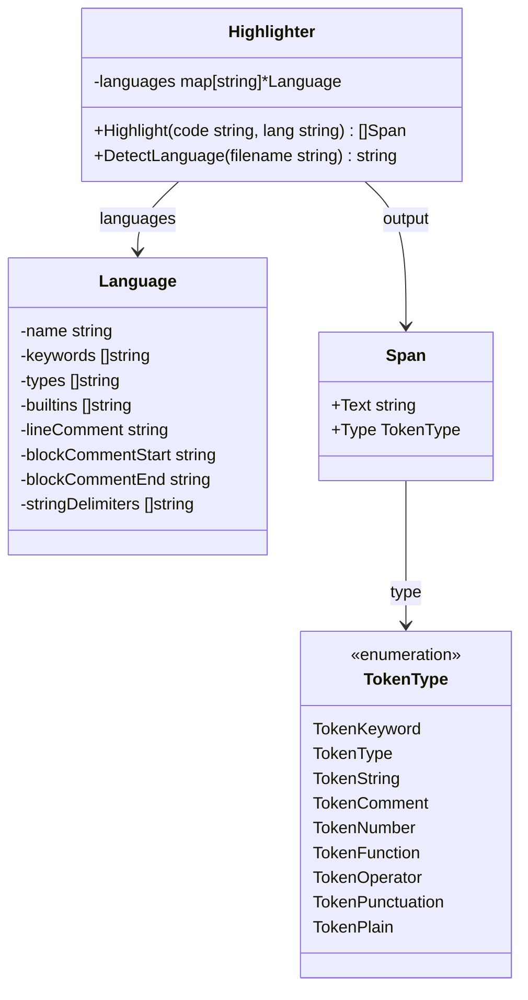
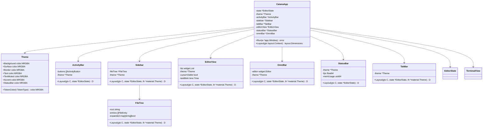
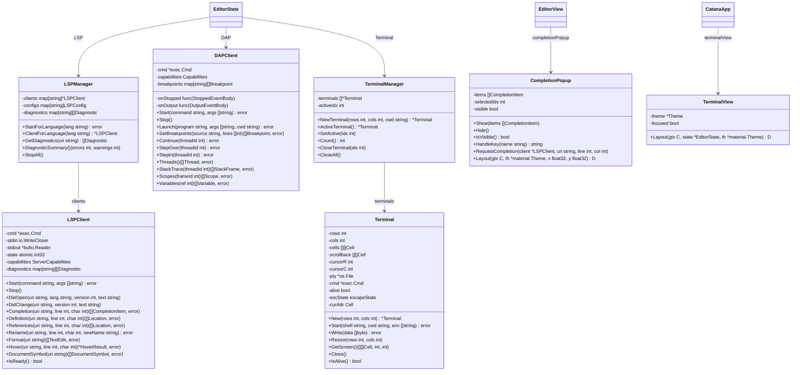
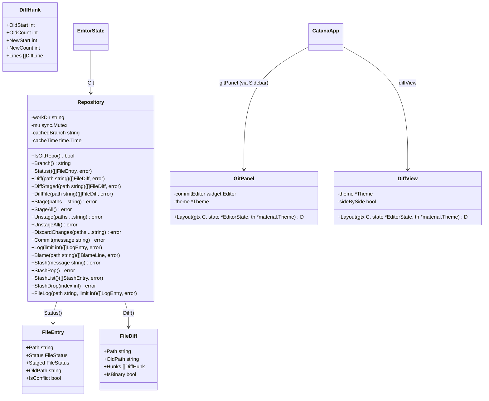
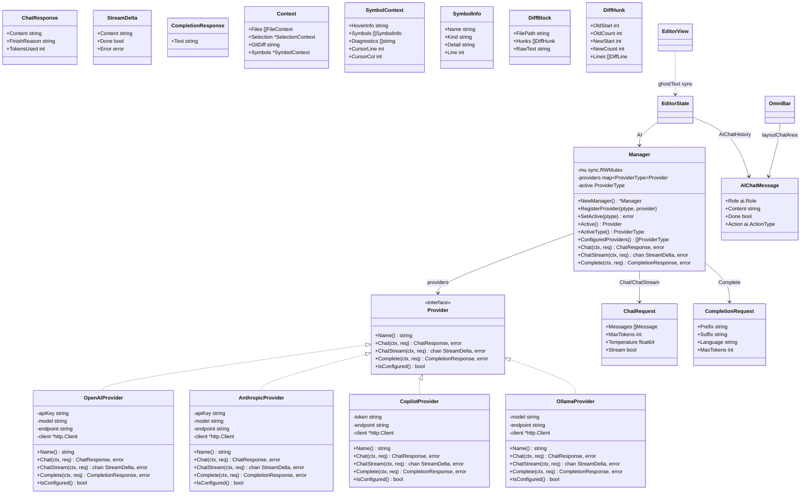

# Catana クラス図

## コアデータ構造

```mermaid
classDiagram
    class Rope {
        -root *ropeNode
        +NewRope(text string) *Rope
        +Insert(pos int, text string)
        +Delete(start int, end int)
        +String() string
        +Substring(start int, end int) string
        +Length() int
        +LineCount() int
        +Line(n int) string
        +LineStart(n int) int
        +PosToLineCol(pos int) (int, int)
        +LineColToPos(line int, col int) int
    }

    class ropeNode {
        -weight int
        -left *ropeNode
        -right *ropeNode
        -text []byte
        +isLeaf() bool
        +length() int
    }

    class Buffer {
        -rope *Rope
        -cursorPos int
        -selectionStart int
        -selectionEnd int
        -undoStack []UndoEntry
        -redoStack []UndoEntry
        -lineCache []int
        +InsertText(text string)
        +DeleteBackward()
        +DeleteForward()
        +MoveCursorLeft()
        +MoveCursorRight()
        +MoveCursorUp()
        +MoveCursorDown()
        +CursorLine() int
        +CursorCol() int
        +LineCount() int
        +Line(n int) string
        +Undo()
        +Redo()
        +Text() string
    }

    class UndoEntry {
        -action UndoAction
        -pos int
        -text string
    }

    Rope --> ropeNode : root
    Buffer --> Rope : rope
    Buffer --> UndoEntry : undoStack/redoStack
```

## エディタ状態管理

```mermaid
classDiagram
    class EditorState {
        -workspace string
        -documents []*Document
        -activeDocIdx int
        -sidebarOpen bool
        -sidebarTab SidebarTab
        -omniMode OmniMode
        -showOmniChat bool
        +OpenFile(path string) error
        +SaveActiveFile() error
        +MovePath(srcPath string, dstDir string) (string, error)
        +RenamePath(oldPath string, newName string) (string, error)
        +DeletePath(targetPath string) error
        +CloseTab(idx int)
        +ActiveDocument() *Document
        +SetSidebarTab(tab SidebarTab)
        +ToggleSidebar()
    }

    class Document {
        -filePath string
        -fileName string
        -buffer *Buffer
        -modified bool
        -language string
        -highlightedLines [][]Span
        +Save() error
        +UpdateHighlight(h *Highlighter)
    }

    class SidebarTab {
        <<enumeration>>
        TabFiles
        TabSearch
        TabGit
        TabExtensions
    }

    class OmniMode {
        <<enumeration>>
        ModeAI
        ModeCmd
        ModeTerm
    }

    EditorState --> Document : documents
    EditorState --> SidebarTab : sidebarTab
    EditorState --> OmniMode : omniMode
    Document --> Buffer : buffer
```

## シンタックスハイライト

```mermaid
classDiagram
    class Highlighter {
        -languages map[string]*Language
        +Highlight(code string, lang string) []Span
        +DetectLanguage(filename string) string
    }

    class Language {
        -name string
        -keywords []string
        -types []string
        -builtins []string
        -lineComment string
        -blockCommentStart string
        -blockCommentEnd string
        -stringDelimiters []string
    }

    class Span {
        +Text string
        +Type TokenType
    }

    class TokenType {
        <<enumeration>>
        TokenKeyword
        TokenType
        TokenString
        TokenComment
        TokenNumber
        TokenFunction
        TokenOperator
        TokenPunctuation
        TokenPlain
    }

    Highlighter --> Language : languages
    Highlighter --> Span : output
    Span --> TokenType : type
```

## UIレイヤー

```mermaid
classDiagram
    class CatanaApp {
        -state *EditorState
        -theme *Theme
        -activityBar *ActivityBar
        -sidebar *Sidebar
        -tabBar *TabBar
        -editorView *EditorView
        -statusBar *StatusBar
        -omniBar *OmniBar
        +Run(w *app.Window) error
        +Layout(gtx layout.Context) layout.Dimensions
    }

    class Theme {
        +Background color.NRGBA
        +Surface color.NRGBA
        +Border color.NRGBA
        +Text color.NRGBA
        +TextMuted color.NRGBA
        +Accent color.NRGBA
        +StatusBar color.NRGBA
        +TokenColor(t TokenType) color.NRGBA
    }

    class ActivityBar {
        -buttons []ActivityButton
        -theme *Theme
        +Layout(gtx C, state *EditorState) D
    }

    class Sidebar {
        -fileTree *FileTree
        -theme *Theme
        +Layout(gtx C, state *EditorState, th *material.Theme) D
    }

    class FileTree {
        -root string
        -entries []FileEntry
        -expanded map[string]bool
        +Layout(gtx C, state *EditorState, th *material.Theme) D
    }

    class EditorView {
        -list widget.List
        -theme *Theme
        -cursorVisible bool
        -lastBlink time.Time
        +Layout(gtx C, state *EditorState, th *material.Theme) D
    }

    class OmniBar {
        -editor widget.Editor
        -theme *Theme
        +Layout(gtx C, state *EditorState, th *material.Theme) D
    }

    class StatusBar {
        -theme *Theme
        -fps float64
        -memUsage uint64
        +Layout(gtx C, state *EditorState) D
    }

    class TabBar {
        -theme *Theme
        +Layout(gtx C, state *EditorState, th *material.Theme) D
    }

    CatanaApp --> EditorState
    CatanaApp --> Theme
    CatanaApp --> ActivityBar
    CatanaApp --> Sidebar
    CatanaApp --> TabBar
    CatanaApp --> EditorView
    CatanaApp --> StatusBar
    CatanaApp --> OmniBar
    CatanaApp --> TerminalView
    Sidebar --> FileTree
```

## プロトコル統合 (Phase 3)

```mermaid
classDiagram
    class LSPClient {
        -cmd *exec.Cmd
        -stdin io.WriteCloser
        -stdout *bufio.Reader
        -state atomic.Int32
        -capabilities ServerCapabilities
        -diagnostics map[string][]Diagnostic
        +Start(command string, args []string) error
        +Stop()
        +DidOpen(uri string, lang string, version int, text string)
        +DidChange(uri string, version int, text string)
        +Completion(uri string, line int, char int) ([]CompletionItem, error)
        +Definition(uri string, line int, char int) ([]Location, error)
        +References(uri string, line int, char int) ([]Location, error)
        +Rename(uri string, line int, char int, newName string) error
        +Format(uri string) ([]TextEdit, error)
        +Hover(uri string, line int, char int) (*HoverResult, error)
        +DocumentSymbol(uri string) ([]DocumentSymbol, error)
        +IsReady() bool
    }

    class LSPManager {
        -clients map[string]*LSPClient
        -configs map[string]LSPConfig
        -diagnostics map[string][]Diagnostic
        +StartForLanguage(lang string) error
        +ClientForLanguage(lang string) *LSPClient
        +GetDiagnostics(uri string) []Diagnostic
        +DiagnosticSummary() (errors int, warnings int)
        +StopAll()
    }

    class DAPClient {
        -cmd *exec.Cmd
        -capabilities Capabilities
        -breakpoints map[string][]Breakpoint
        -onStopped func(StoppedEventBody)
        -onOutput func(OutputEventBody)
        +Start(command string, args []string) error
        +Stop()
        +Launch(program string, args []string, cwd string) error
        +SetBreakpoints(source string, lines []int) ([]Breakpoint, error)
        +Continue(threadId int) error
        +StepOver(threadId int) error
        +StepIn(threadId int) error
        +Threads() ([]Thread, error)
        +StackTrace(threadId int) ([]StackFrame, error)
        +Scopes(frameId int) ([]Scope, error)
        +Variables(ref int) ([]Variable, error)
    }

    class Terminal {
        -rows int
        -cols int
        -cells [][]Cell
        -scrollback [][]Cell
        -cursorR int
        -cursorC int
        -pty *os.File
        -cmd *exec.Cmd
        -alive bool
        -escState escapeState
        -curAttr Cell
        +New(rows int, cols int) *Terminal
        +Start(shell string, cwd string, env []string) error
        +Write(data []byte) error
        +Resize(rows int, cols int)
        +GetScreen() ([][]Cell, int, int)
        +Close()
        +IsAlive() bool
    }

    class TerminalManager {
        -terminals []*Terminal
        -activeIdx int
        +NewTerminal(rows int, cols int, cwd string) *Terminal
        +ActiveTerminal() *Terminal
        +SetActive(idx int)
        +Count() int
        +CloseTerminal(idx int)
        +CloseAll()
    }

    class CompletionPopup {
        -items []CompletionItem
        -selectedIdx int
        -visible bool
        +Show(items []CompletionItem)
        +Hide()
        +IsVisible() bool
        +HandleKey(name string) string
        +RequestCompletion(client *LSPClient, uri string, line int, col int)
        +Layout(gtx C, th *material.Theme, x float32, y float32) D
    }

    class TerminalView {
        -theme *Theme
        -focused bool
        +Layout(gtx C, state *EditorState, th *material.Theme) D
    }

    LSPManager --> LSPClient : clients
    TerminalManager --> Terminal : terminals
    EditorState --> LSPManager : LSP
    EditorState --> DAPClient : DAP
    EditorState --> TerminalManager : Terminal
    EditorView --> CompletionPopup : completionPopup
    CatanaApp --> TerminalView : terminalView
```

## Git統合 (Phase 4)

```mermaid
classDiagram
    class Repository {
        -workDir string
        -mu sync.Mutex
        -cachedBranch string
        -cacheTime time.Time
        +IsGitRepo() bool
        +Branch() string
        +Status() ([]FileEntry, error)
        +Diff(path string) ([]FileDiff, error)
        +DiffStaged(path string) ([]FileDiff, error)
        +DiffFile(path string) ([]FileDiff, error)
        +Stage(paths ...string) error
        +StageAll() error
        +Unstage(paths ...string) error
        +UnstageAll() error
        +DiscardChanges(paths ...string) error
        +Commit(message string) error
        +Log(limit int) ([]LogEntry, error)
        +Blame(path string) ([]BlameLine, error)
        +Stash(message string) error
        +StashPop() error
        +StashList() ([]StashEntry, error)
        +StashDrop(index int) error
        +FileLog(path string, limit int) ([]LogEntry, error)
    }

    class FileEntry {
        +Path string
        +Status FileStatus
        +Staged FileStatus
        +OldPath string
        +IsConflict bool
    }

    class FileDiff {
        +Path string
        +OldPath string
        +Hunks []DiffHunk
        +IsBinary bool
    }

    class DiffHunk {
        +OldStart int
        +OldCount int
        +NewStart int
        +NewCount int
        +Lines []DiffLine
    }

    class GitPanel {
        -commitEditor widget.Editor
        -theme *Theme
        +Layout(gtx C, state *EditorState, th *material.Theme) D
    }

    class DiffView {
        -theme *Theme
        -sideBySide bool
        +Layout(gtx C, state *EditorState, th *material.Theme) D
    }

    Repository --> FileEntry : Status()
    Repository --> FileDiff : Diff()
    EditorState --> Repository : Git
    CatanaApp --> GitPanel : gitPanel (via Sidebar)
    CatanaApp --> DiffView : diffView
```

## Phase 5: AI統合

```mermaid
classDiagram
    class Provider {
        <<interface>>
        +Name() string
        +Chat(ctx, req) ChatResponse, error
        +ChatStream(ctx, req) chan StreamDelta, error
        +Complete(ctx, req) CompletionResponse, error
        +IsConfigured() bool
    }

    class Manager {
        -mu sync.RWMutex
        -providers map~ProviderType~Provider
        -active ProviderType
        +NewManager() *Manager
        +RegisterProvider(ptype, provider)
        +SetActive(ptype) error
        +Active() Provider
        +ActiveType() ProviderType
        +ConfiguredProviders() []ProviderType
        +Chat(ctx, req) ChatResponse, error
        +ChatStream(ctx, req) chan StreamDelta, error
        +Complete(ctx, req) CompletionResponse, error
    }

    class OpenAIProvider {
        -apiKey string
        -model string
        -endpoint string
        -client *http.Client
        +Name() string
        +Chat(ctx, req) ChatResponse, error
        +ChatStream(ctx, req) chan StreamDelta, error
        +Complete(ctx, req) CompletionResponse, error
        +IsConfigured() bool
    }

    class AnthropicProvider {
        -apiKey string
        -model string
        -endpoint string
        -client *http.Client
        +Name() string
        +Chat(ctx, req) ChatResponse, error
        +ChatStream(ctx, req) chan StreamDelta, error
        +Complete(ctx, req) CompletionResponse, error
        +IsConfigured() bool
    }

    class CopilotProvider {
        -token string
        -endpoint string
        -client *http.Client
        +Name() string
        +Chat(ctx, req) ChatResponse, error
        +ChatStream(ctx, req) chan StreamDelta, error
        +Complete(ctx, req) CompletionResponse, error
        +IsConfigured() bool
    }

    class OllamaProvider {
        -model string
        -endpoint string
        -client *http.Client
        +Name() string
        +Chat(ctx, req) ChatResponse, error
        +ChatStream(ctx, req) chan StreamDelta, error
        +Complete(ctx, req) CompletionResponse, error
        +IsConfigured() bool
    }

    class ChatRequest {
        +Messages []Message
        +MaxTokens int
        +Temperature float64
        +Stream bool
    }

    class ChatResponse {
        +Content string
        +FinishReason string
        +TokensUsed int
    }

    class StreamDelta {
        +Content string
        +Done bool
        +Error error
    }

    class CompletionRequest {
        +Prefix string
        +Suffix string
        +Language string
        +MaxTokens int
    }

    class CompletionResponse {
        +Text string
    }

    class Context {
        +Files []FileContext
        +Selection *SelectionContext
        +GitDiff string
        +Symbols *SymbolContext
    }

    class SymbolContext {
        +HoverInfo string
        +Symbols []SymbolInfo
        +Diagnostics []string
        +CursorLine int
        +CursorCol int
    }

    class SymbolInfo {
        +Name string
        +Kind string
        +Detail string
        +Line int
    }

    class DiffBlock {
        +FilePath string
        +Hunks []DiffHunk
        +RawText string
    }

    class DiffHunk {
        +OldStart int
        +OldCount int
        +NewStart int
        +NewCount int
        +Lines []DiffLine
    }

    class AIChatMessage {
        +Role ai.Role
        +Content string
        +Done bool
        +Action ai.ActionType
    }

    Provider <|.. OpenAIProvider
    Provider <|.. AnthropicProvider
    Provider <|.. CopilotProvider
    Provider <|.. OllamaProvider
    Manager --> Provider : providers
    Manager --> ChatRequest : Chat/ChatStream
    Manager --> CompletionRequest : Complete
    EditorState --> Manager : AI
    EditorState --> AIChatMessage : AIChatHistory
    OmniBar --> AIChatMessage : layoutChatArea
    EditorView ..> EditorState : ghostText sync
```
